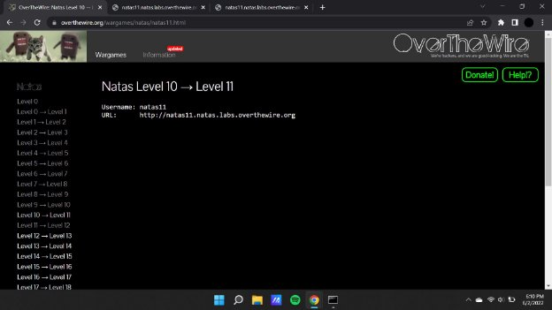
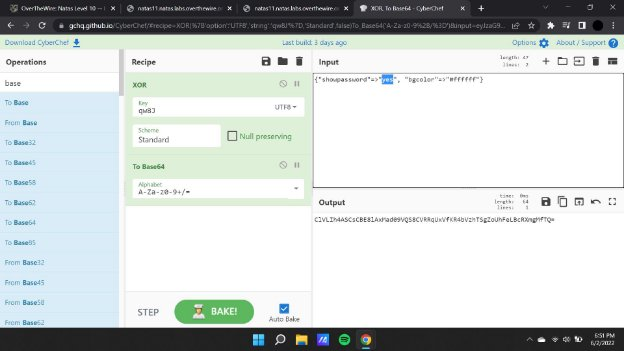

**Natas (OTW)**

**Natas 11 Writeup:**

Natas level 10 —>11

Checking the value of the cookies which is base 64 encoded and stored within the server.

Using a cookie editor we will copy down the encoded that has been encoded base 64 technique.

**Payload :** ClVLIh4ASCsCBE8lAxMad09VViVTWxhoExBbJR0YSmhMSRppFxFeLBcRGkB9

**PAYLOAD :** ClVLIh4ASCsCBE8lAxMad09VViVTWxhoExBbJR0YSmhMSRppFxFeLBcRGkB9

Changing the value of the parameter for “no” to “yes”. To change the output of the challenge and obtaining the password for the next challenge.

**Natas12 :** EDXp0pS26wLKHZy1rDBPUZk0RKfLGIR3
