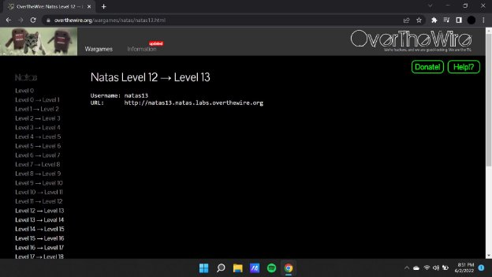
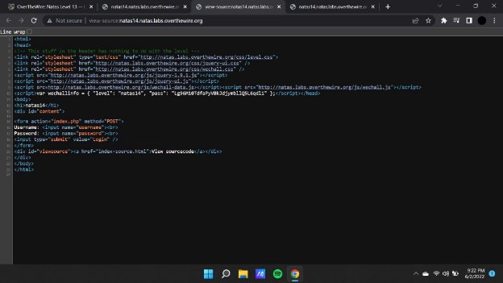
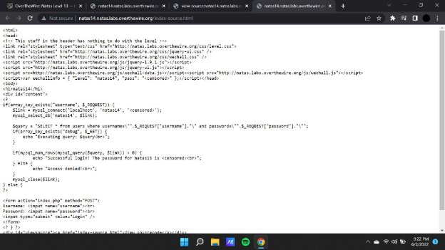
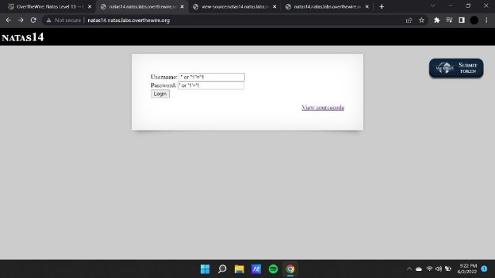

**Natas (OTW)**

**Natas 13 Writeup:**

Natas level 12 —>13

On following up with the source code we see that it has a database attached to the webpage which is retrieving data according to the input that is being entered in the username and password fields.

As there is a database we will use sql injections and create payloads to retrieve data from the database.

Therefore we continue by breaking the payload using “ or “1”=”1 and this will lead us to inject with in the database and extract the required information which is the password to crack the next level.
