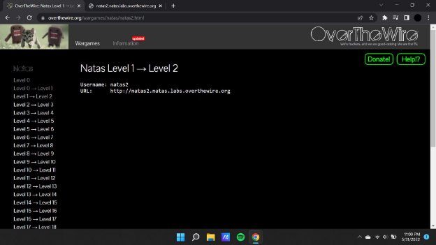
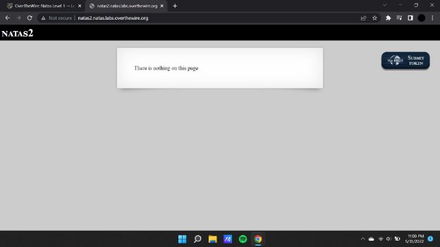
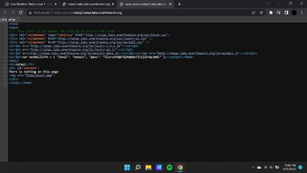
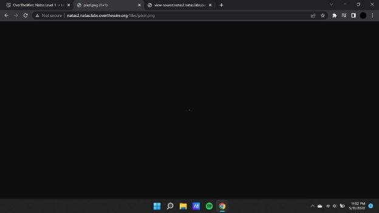
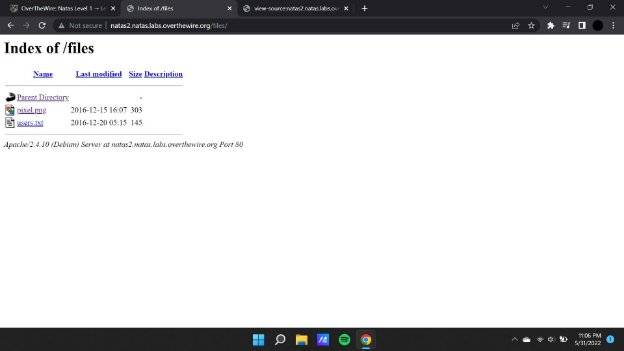
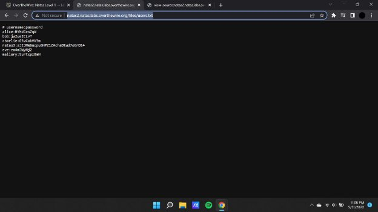

**Natas (OTW)**

**Natas 2 Writeup:**

Natas level 1 —>2

The image source in this source code is obtained from a directory : “[**files/pixel.png**](http://natas2.natas.labs.overthewire.org/files/pixel.png)”

**Payload : [http://natas2.natas.labs.overthewire.org/files/pixel.png**](http://natas2.natas.labs.overthewire.org/files/pixel.png)**

When the specified file is opened via opening the directory we see an image of one pixel, thereby we can check for the files that are present within the directory other than the image file.\

**Payload : <http://natas2.natas.labs.overthewire.org/files/>”**

**Payload : [http://natas2.natas.labs.overthewire.org/files/users.txt**](http://natas2.natas.labs.overthewire.org/files/users.txt)**

On opening the user.txt file we find the password that is necessary for accessing the next challenge.

