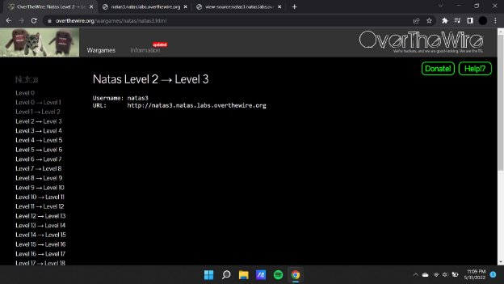
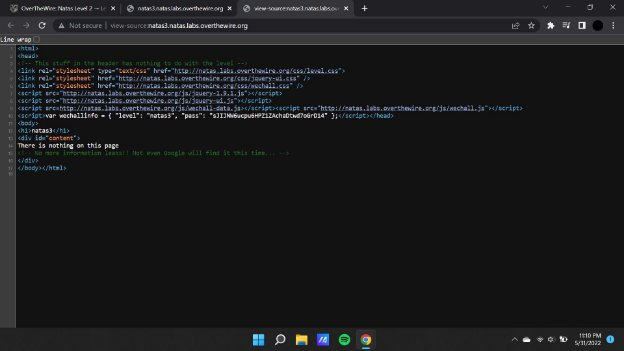
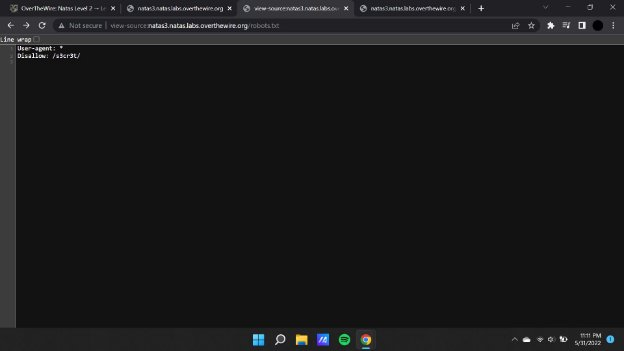
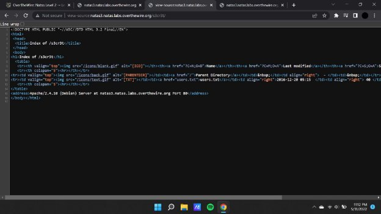
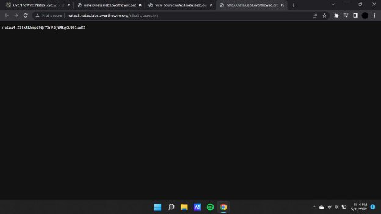

**Natas (OTW)**

**Natas 3 Writeup:**

Natas level 2 —>3

**Payload : view-source:[http://natas3.natas.labs.overthewire.org/robots.txt**](http://natas3.natas.labs.overthewire.org/robots.txt*)**

**On opening the source we see that there is a certain file or directory that has been disallowed , we thereby access this via the url.**

**Payload : view-source:[http://natas3.natas.labs.overthewire.org/s3cr3t/**](http://natas3.natas.labs.overthewire.org/s3cr3t/)**

Now we proceed by accessing the user.txt file that is linked in the source code which then in turn provides us the password required for the next challenge.

**Payload : [http://natas3.natas.labs.overthewire.org/s3cr3t/users.txt**](http://natas3.natas.labs.overthewire.org/s3cr3t/users.txt)**

