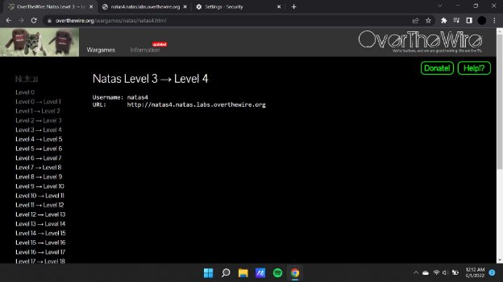
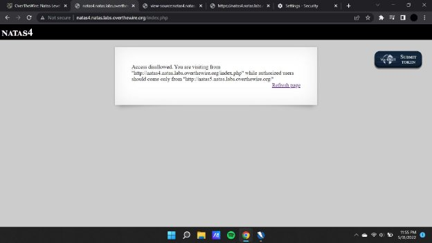
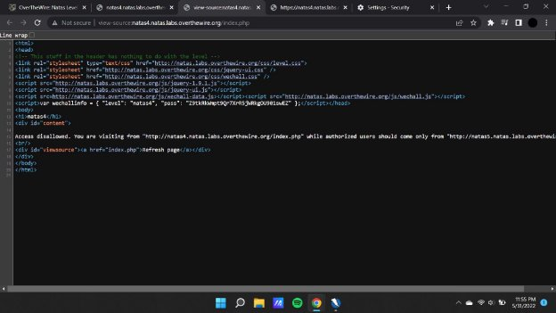
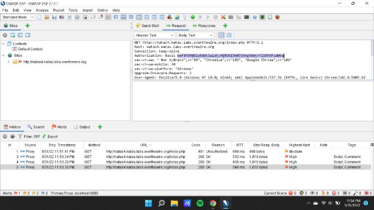
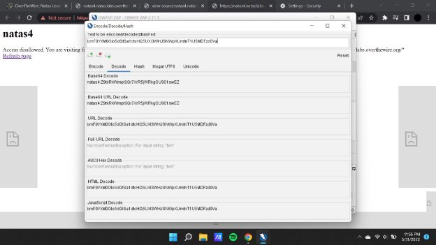
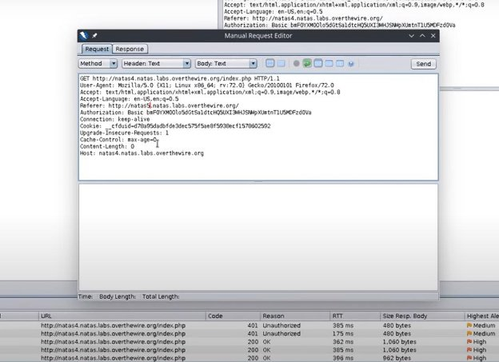

**Natas (OTW)**

**Natas 4 Writeup:**

Natas level 3 —>4

The basic idea of this particular challenge is to change the status of the refer from natas 4 to natas 5

Using the hint that has been given to us in the above source code we get an idea that the refer has to be changed or modified in order to retain the password

Here we decode the authorization value using base 64 decoding  that is inbuilt within the owasp zap application.

After base 64 decoding the authorization key we find the value of the password that is required for opening the next level.

**Natas4 :** Z9tkRkWmpt9Qr7XrR5jWRkgOU901swEZ

Now we manually change the referrer from natas 4 to natas 5  by editing to get a different password value , which is the password to unlock the next level..

**Natas5 :** iX6IOfmpN7AYOQGPwtn3fXpbaJVJcHfq
