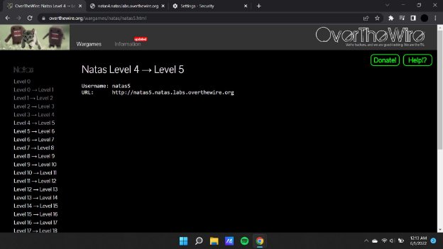
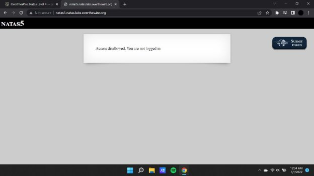
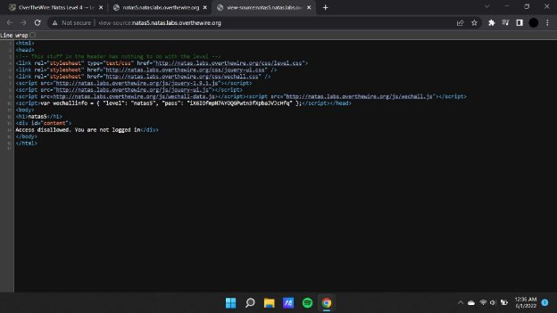
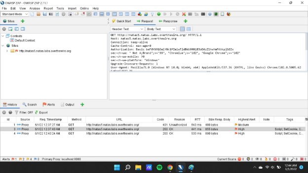
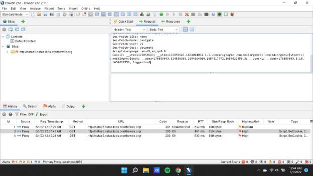
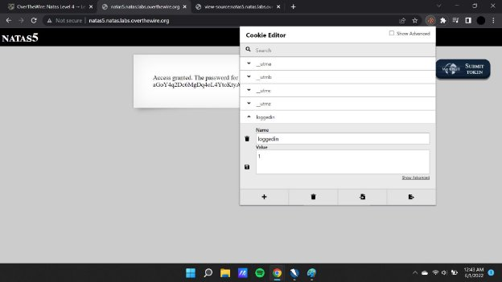
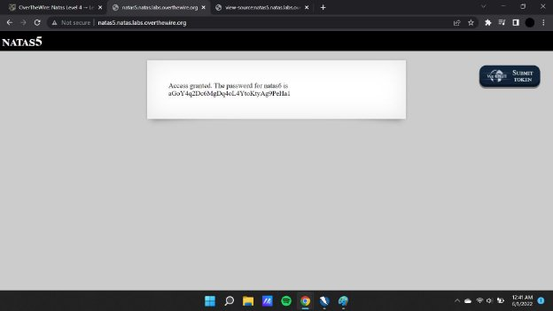

**Natas (OTW)**

**Natas 5 Writeup:**

Natas level 4 —>5

Similar to the previous challenge in this challenge we use owasp zap application. As the hint suggests that we aren't logged in.

In this case we see that there is a cookie whose value has been set to “0” which is a false value that has been entered,therefore we have to alter this value and set it to “1” which will make the value true and therefore allow us to find the password.

We use a cookie editor to alter the value of the cookie and save it to mend the changes , thereafter we get the password to the next challenge.

