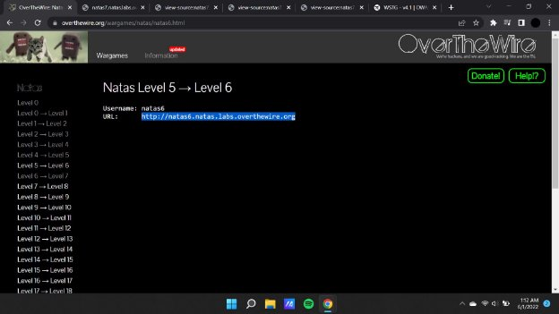
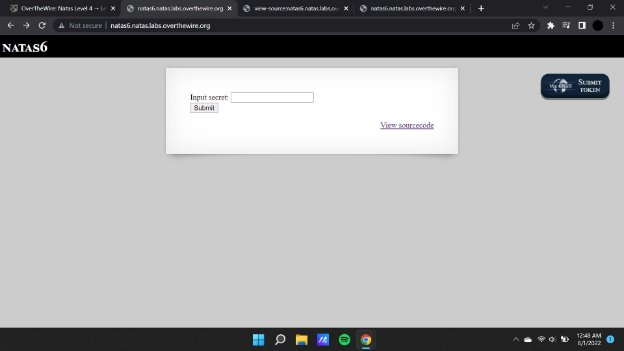
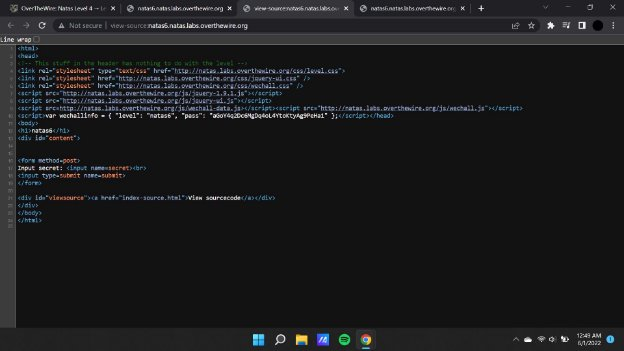
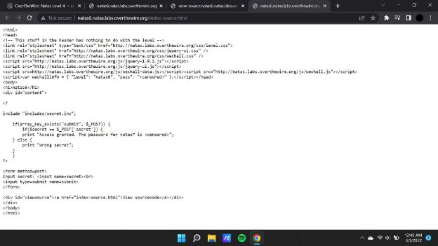
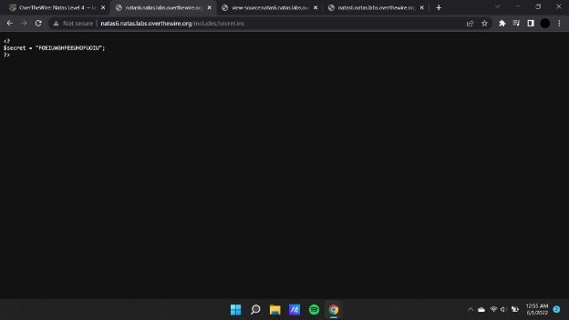
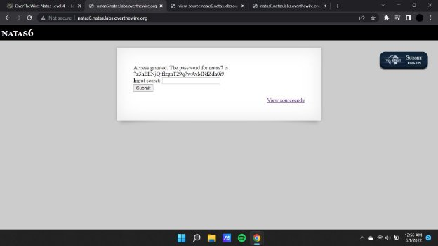

**Natas (OTW)**

**Natas 6 Writeup:**

Natas level 5 —>6

In this challenge we see that we are been given a text box or a text with the help of which we have to enter the secret key to crack the password to the next challenge.

Here we see that there is some sought of secret key that is required for retrieving or cracking the password.

When we check the script that is provided to us as a href link we find that a specific directory is included to evaluate the input value with the actual key.

**Payload :[http://natas6.natas.labs.overthewire.org/includes/secret.inc**](http://natas6.natas.labs.overthewire.org/includes/secret.inc)**

**Secret key :** FOEIUWGHFEEUHOFUOIU

