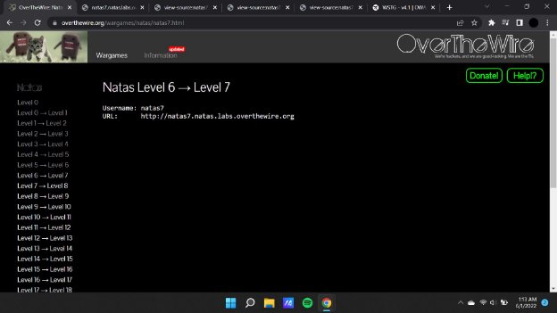
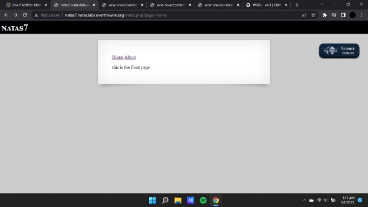
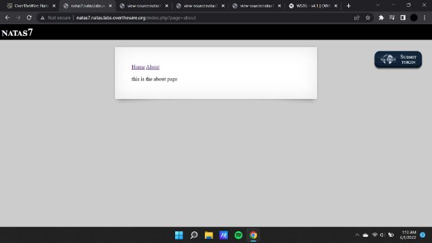
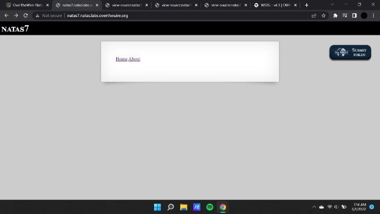
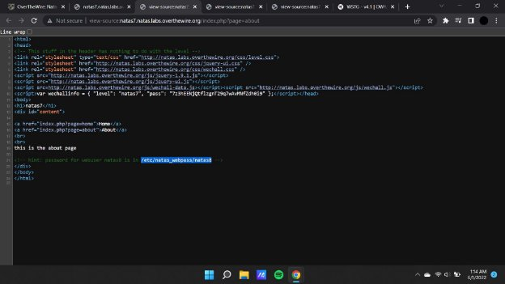
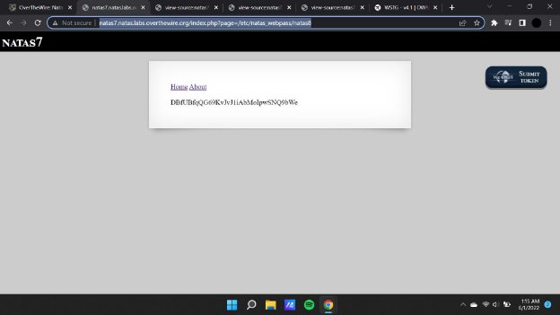

**Natas (OTW)**

**Natas 7 Writeup:**

Natas level 6 —>7

In this challenge we were given a web page with 2 hyperlinks as home and about pages with a simple php based code.

The following is the about page:

On inspecting the source code of the page we find out that there is a certain directory that holds some information , therefore we will input the file location as the payload in the url so that we can retrieve the data.

**Payload : [http://natas7.natas.labs.overthewire.org/index.php?page=/etc/natas_webpass/natas8**](http://natas7.natas.labs.overthewire.org/index.php?page=/etc/natas_webpass/natas8)**

