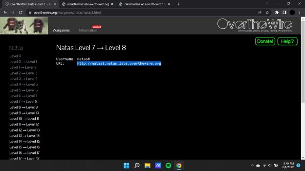
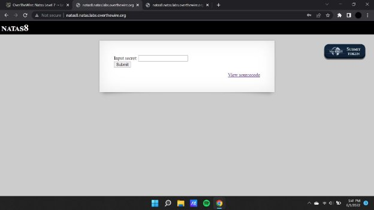
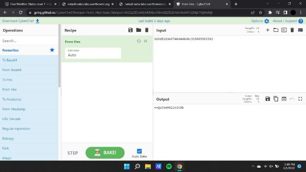
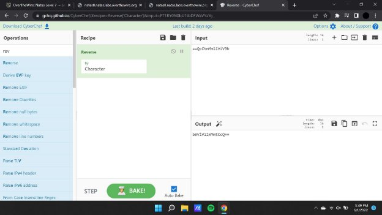
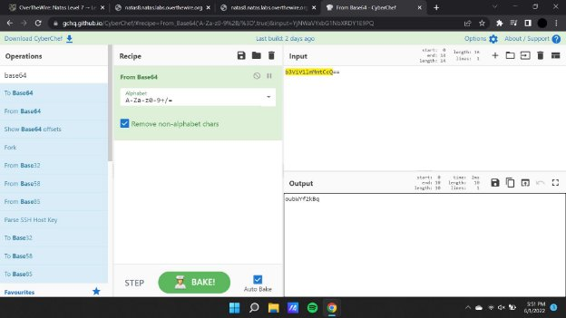
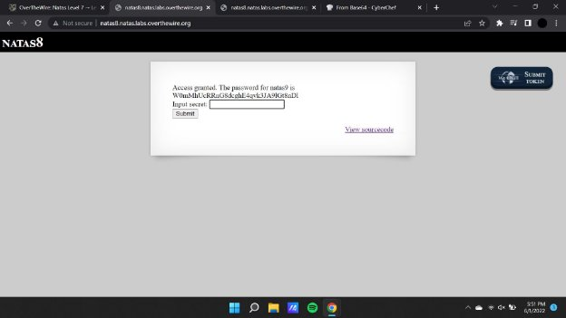

**Natas (OTW)**

**Natas 8 Writeup:**

Natas level 7 —>8

On inspecting the source code of the page we find out that there is a certain way that the information is encoded , therefore we will decode the payload in the url so that we can retrieve the data.

- bin2hex(strrev(base64\_encode($secret)))”

- bin2hex(strrev(base64\_encode($secret)))”

This is the format in which it is encoded and has to be decoded one by one by using the above encoding techniques.

Now using the key that we have procured after the combination of decoding , we input the key in the text area field to obtain the password.

**Natas9** : W0mMhUcRRnG8dcghE4qvk3JA9lGt8nDl
